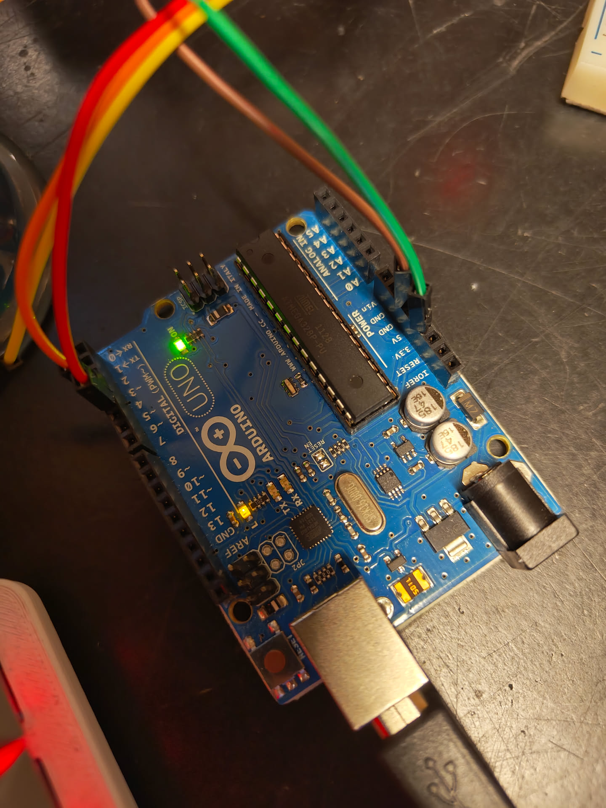
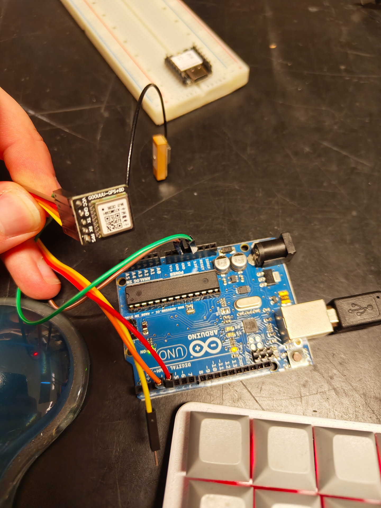
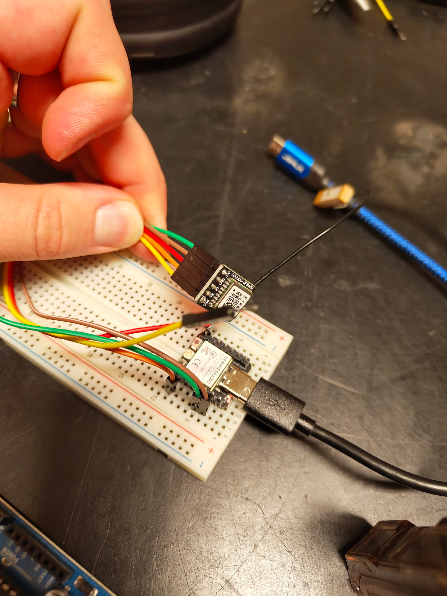
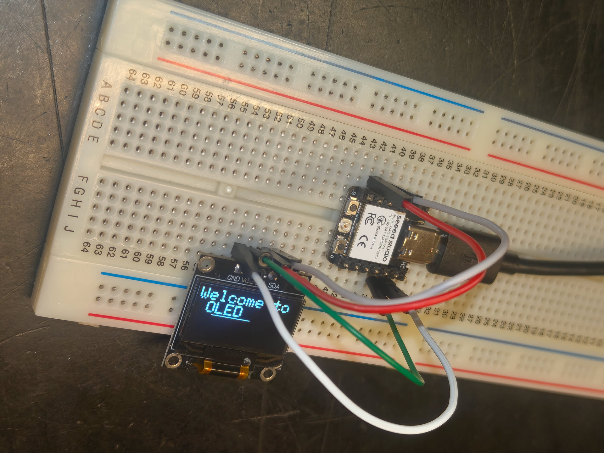
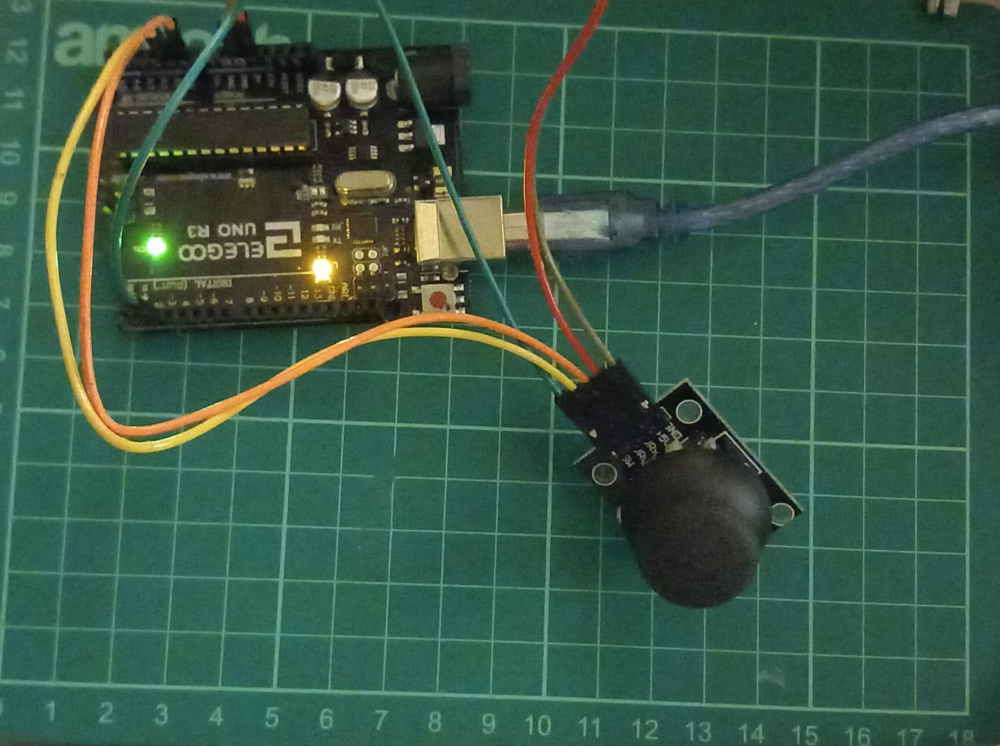
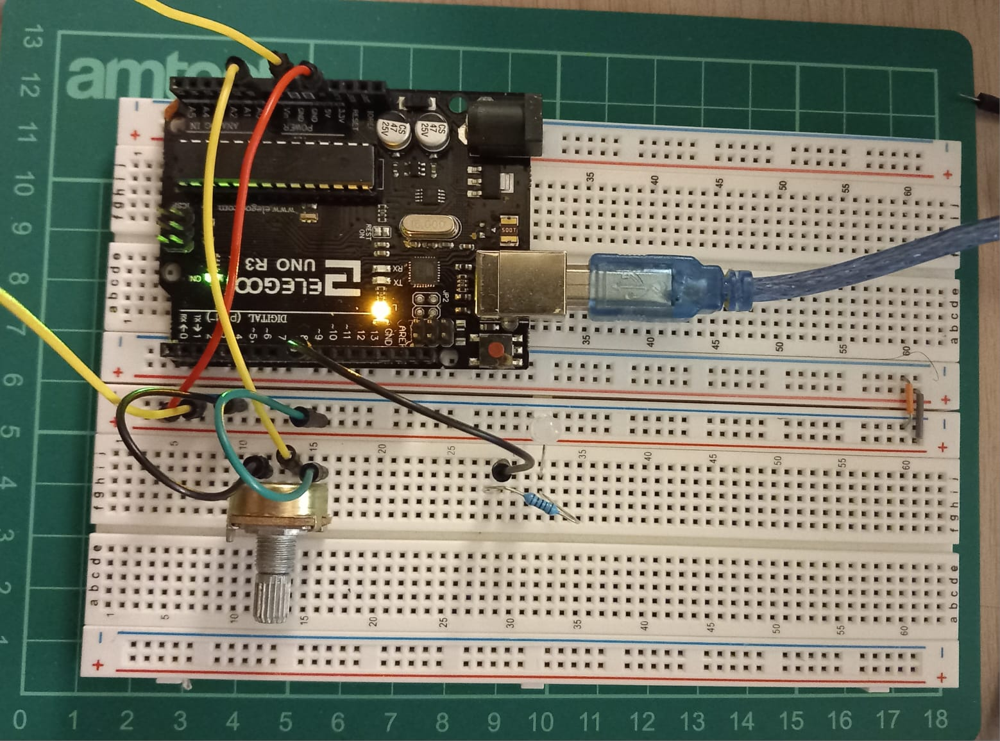

# Makerspace Electronics Projects 🚀

A collection of embedded projects using Arduino, ESP32, and various sensors/displays.

## Projects

### 1. Arduino GPS 
Simple GPS tracking project with Arduino

### 2. ESP32 GPS 
GPS tracking using ESP32 

### 3. ESP32 MPU6050
Accelerometer and gyroscope project

### 4. ESP32 OLED Display 
Small OLED display project with ESP32

### 5. Arduino Joystick
Reading the values of a Joystick

### 6. Arduino Potentiometer
Brightness Control using Potentiometer

